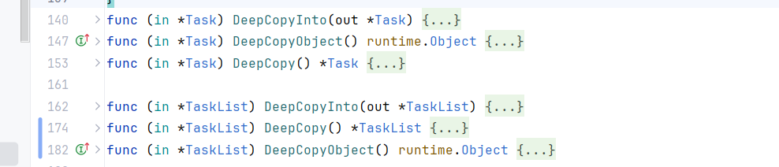
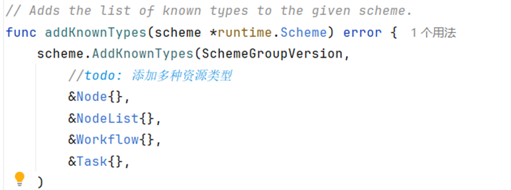
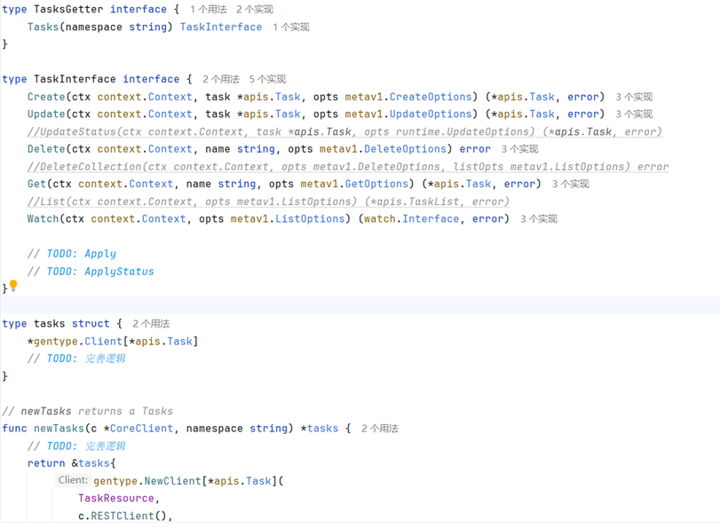
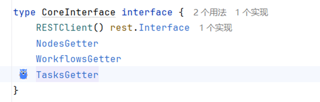
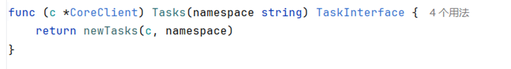

# 如何新增资源客户端

## 在client-go中新增资源及其客户端，需要实现新增资源的Client、将Client注册到clientset.go中等步骤。

## 以task为例:

1.在apis/cores/types.go 中定义新增的资源类型和资源列表类型

2.在pkg/apis/cores/deepcopy.go中加入TaskList struct与DeepCopy相关的6个方法，应使用自动生成deepcopy的脚本进行生成。

3.在apis/cores/register.go 的 addKnowTypes 中加入资源类型与资源列表类型

4.在client-go/clients/typed/core下加入task.go并仿照workflow补充，可以将workflow.go内容复制过来，直接把Workflow/workflow替换为Task/task。

 

5.在client-go/clients/typed/core/core_client中的CoreInterface 中补上TasksGetter，并对CoreClient 补Tasks方法

 

 